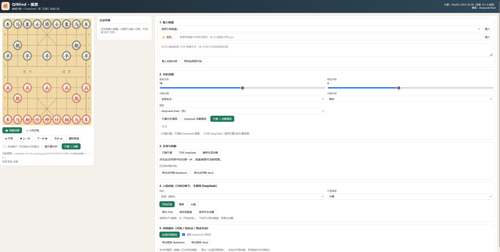

# QiMind · 棋思

> 给棋谱配上人话：用中国象棋引擎（Pikafish 皮卡鱼）算清「正着」，
> 再用 DeepSeek 把它讲成「为什么这么走」。

QiMind 是一个本地运行的中国象棋讲解工具。它不只是告诉你引擎推荐哪一步，
而是把**引擎的结论**翻译成棋迷能读懂的自然语言：这步棋在做什么、好在哪、
对方该怎么应、走完之后要小心什么。



## 它解决什么问题

象棋棋谱里只记了「走了什么」，引擎只给了「哪一步最好」和一个分数。
但对多数爱好者来说，真正难的是理解下面这几件事：

- 这一步到底是**进攻**、**防守**，还是**调整阵形**？
- 它同时完成了哪几件事（占位、威胁、给别的子让路）？
- 对方的应手是什么？我接下来该怎么走？
- 实战这一步和引擎正着差在哪里？亏了多少？

QiMind 把「棋谱 → 引擎分析 → 结构化事实 → 人话讲解 → 图形界面」串成一条流水线，
让每个局面都能被读懂。

## 效果示例

以《中炮对列炮 黑先平士角炮》开局前三步为例（真实运行输出）：

```text
#1 第 1 回合（红方）炮二平五
引擎正着：炮二平五（大致均势）  深度 14
实战走法：炮二平五（与正着一致）
### 一句话
中炮抢占中路，顺手瞄住黑卒与黑马。
### 为什么
- 一举两得：架中炮既控制中路（棋盘中心线），又直接盯住黑方 e6 的卒——这个卒没有保护，黑方得先处理。
- 子力完全对等（双方各 4800），但红方先手出动大子，黑方必须花一步应付中路压力，等于让红方白赚一先。
- 后续马二进三、车一平二都是自然出子，阵形顺畅，不耽误开动右翼。
### 要注意
- 黑方多半走马８进７护中卒，顺手出子，这步并不吃亏。
### 详细说明
炮二平五是标准的中炮……开局阶段别急着吃子，看谁先把马位、车位腾干净。

#2 第 1 回合（黑方）炮２平５
引擎正着：马８进７（大致均势）  深度 14
实战走法：炮２平５（与正着相差 14 分）
### 一句话
架中炮瞄中兵，却没护住自己中卒，先手偏缓。
...
```

界面里同一份结果会显示成：左边的棋盘（带实战走法箭头与引擎正着箭头）、
中间的走法列表（每步标注「正着 / 可改进 / 疑问手 / 漏着」）、
右边的正着候选表、讲解正文，以及可展开的「引擎事实清单」。

## 三个关键设计

1. **先事实、后语言**
   引擎跑完不是直接把分数丢给大模型，而是先由 `qimind/facts.py` 生成一张
   **结构化事实清单**：子力对比、悬子与被攻击的棋子、将军状态、士象完整度、
   机动性、候选着法评分、引擎主线、实战走法与正着的分差。
   大模型只负责「把事实组织成人话」，从源头压缩胡编空间。

2. **多路分析（MultiPV）+ 复算**
   引擎一次给出前 N 个候选走法与后续主线，于是可以回答「是不是唯一正着」
   （首选与次选差多少分）；实战走法如果不在候选里，还会用引擎复算一步，
   得出「这步亏了多少分」。

3. **一切皆可缓存**
   引擎结果按「局面 + 深度 + 候选数」缓存，讲解按「提示词版本 + 模型 + 事实清单」
   缓存。同一局棋看第二遍几乎瞬时返回，重复调试也不浪费额度。

## 快速开始

### 0. 环境要求

- Windows / macOS / Linux，Python 3.10+
- 本仓库已内置：`cchess`（Python 象棋库）、`Pikafish` 引擎（含 `pikafish.nnue` 权重）
- 一个 DeepSeek API Key（可选，不配也能只用引擎分析）

### 1. 安装依赖

```bash
pip install openai fastapi uvicorn chardet requests
```

### 2. 配置 DeepSeek Key

**方式一（推荐）：启动后在界面里填。** 打开页面，滚到右下角「**6. DeepSeek API Key**」卡片，
粘贴 Key → 点「保存」→ 点「测试连接」确认可用即可。保存后立即生效（无需重启服务），
卡片上会显示打码后的 Key 与来源；换 Key、点「清除」都在同一张卡片里完成。

**方式二：环境变量**

```bash
set QIMIND_DEEPSEEK_KEY=sk-xxxx          # Windows
export QIMIND_DEEPSEEK_KEY=sk-xxxx       # macOS / Linux
```

**方式三：直接写文件**，也就是界面保存的那个位置：

```json
{ "deepseek_api_key": "sk-xxxxxx" }
```

即 `qimind/data/secrets.json`（已加入 `.gitignore`，不会被提交）。
优先级：**界面保存的 Key 优先，其次才是环境变量**，所以界面里填的一定会生效。
Key 只在本机使用，仅用于调用 DeepSeek 接口，不会上传到其它地方。

> 只用引擎分析（「引擎分析整局」「只跑引擎」「人机对练」）不需要 Key，
> 不配置也能正常使用，只是没有自然语言讲解。

### 3. 启动图形界面

```bash
python -m qimind gui
```

浏览器会自动打开 `http://127.0.0.1:8765/`。界面上：

1. 在「载入棋谱」里选一个示例，点「📂 浏览…」用系统文件对话框挑本地棋谱（也可填路径 / 粘贴 PGN）；
2. 调整搜索深度（默认 16）、候选步数（默认 4）、讲解范围与风格；
3. 点「开始分析整局」，进度条会逐步推进，**算完一步就先显示一步**；
4. 点走法列表里的任意一步回看，或勾选「自由摆子」自己走几步再问「解释当前局面」。

> Windows 用户也可以直接双击 `run_gui.bat`。

棋盘四周会标出中文习惯的坐标：**列用一~九**（红方视角，一在最右、九在最左，与中文记谱的「路」一致），
**行用 1~10**（从红方底线数起，1 是红方底线、10 是黑方底线）；黑方一侧另外标出全角
１２３４５６７８９（黑方视角的「路」）。讲解事实清单里的坐标（例如「卒 五路7行」）
与棋盘边缘的标注完全对应，翻转棋盘时标注跟着一起翻。

讲解固定分四节：**一句话**（结论）、**为什么**（2–3 条理由）、
**要注意**（对方的应手与风险）、**详细说明**（3–5 句展开讲战术含义、
对方最佳应对后的走势、不理会会怎样，以及一条可迁移的棋理）。

### 分析可以分开调用：引擎是引擎，DeepSeek 是 DeepSeek

导入棋谱后，你可以只做其中一件事，也可以两件都做：

| 按钮 | 做什么 | 什么时候用 |
| --- | --- | --- |
| **引擎分析整局** | 只跑 Pikafish：正着、评分、候选、主线 | 想快速核对棋谱质量，不消耗 API 额度 |
| **DeepSeek 讲解整局** | 复用已算好的引擎结果，只调 DeepSeek 写讲解 | 已经跑过引擎，想补上人话讲解 |
| **引擎 + 讲解整局** | 两步都跑 | 一次到位 |

单步同理：面板里有「只跑引擎」「只讲 DeepSeek」「引擎 + 讲解」，
以及「重新生成讲解」（忽略缓存、换个说法重新写一遍）。
后端对应参数是 `mode: engine | llm | both` 与 `regenerate: true/false`，命令行同理见下。

## 人机对练：先下棋，再复盘

想自己产出棋谱的话，不用到处找对局文件——切到 **⚔ 人机对练** 模式，
只和引擎下，全程不调用 DeepSeek（不消耗 API 额度）：

1. 选「我执」红方或黑方，选引擎强度（入门 / 初级 / 中等 / 较强 / 最强，
   对应搜索深度 2 / 4 / 8 / 12 / 16；玩家执黑时引擎会先走一步）；
2. 点「开始对练」，然后在棋盘上点自己的棋子走子，引擎自动应招；
3. 「悔棋」会一次退回你的上一步（同时撤掉引擎的应招），「认输」直接结束并记录结果；
4. 下完（将死或困毙会自动判定）可以：
   - **导出 PGN** —— 浏览器直接下载；
   - **保存到磁盘** —— 存到 `qimind/data/practice/人机对练_时间_执子.pgn`；
   - **保存并去讲解** —— 保存后自动切回讲解模式并载入这局棋，
     接着点「引擎分析整局」或「引擎 + 讲解整局」就能复盘自己刚下的棋。

导出的 PGN 是标准中文记谱（带 `[FEN]`、`[Engine]` 头），
既能被本工具重新导入，也能丢进象棋软件打谱。

## 变招讲解、对局报告与导出

### 变招讲解：不只讲首选

候选表里每一路都带一个「讲这路」按钮。点它会单独分析该变招（引擎先算它的评分与主线，
再让 DeepSeek 讲三件事）：这步棋想干什么、和引擎首选差在哪里、走这条线之后的后续计划。
适合用来回答「我本来想走这步，行不行」。

### 对局报告：开局 / 转折点 / 致命失误

分析完整局后点「生成对局报告」，会先做确定性统计，再（可选）让 DeepSeek 写成讲评稿：

- **开局判断**：按前几步的着法模式识别（中炮对屏风马、中炮对顺炮/列炮、仙人指路、飞相局……）；
- **双方数据**：总步数、正着率、平均每步损失、最大一步损失、疑问手（≥100 分）与漏着（≥300 分）次数；
- **关键转折**：按「单步损失」与「形势波动」挑出全盘最关键的几步；
- **致命失误**：损失 ≥300 分，或错过杀棋（引擎已看到杀棋却没走）；
- **讲评稿**：开局 → 中局转折 → 失误复盘 → 双方对比 → 改进建议。

统计部分不需要大模型也能出（取消勾选「调用 DeepSeek 写讲评」即可）。

### 导出讲评稿

- 界面里：分析面板底部「导出讲评稿 Markdown / Word」、报告面板「导出报告 Markdown / Word」；
- 导出文件保存在 `qimind/data/exports/`，同时触发浏览器下载；
- Word（.docx）由内置的零依赖生成器写出（标题、小标题、项目符号、表格俱全），
  不需要额外安装 python-docx；
- 命令行同样支持：

```bash
python -m qimind explain "对局.xqf" --with-report --out-md 讲评.md --out-docx 讲评.docx \
    --report-out 报告.md --include-facts
```

### 4. 命令行

```bash
# 环境自检（引擎、棋子库、DeepSeek 三项）
python -m qimind doctor

# 讲解整局棋（默认全部走法，也可 --scope red / black / key）
python -m qimind explain "对局.pgn" --depth 16 --scope all --json out.json

# 只讲前 6 步，快速看效果
python -m qimind explain "对局.xqf" --max-plies 6

# 只跑引擎、不调用大模型
python -m qimind explain "对局.pgn" --no-llm

# 已经跑过引擎后，只补 DeepSeek 讲解（复用引擎缓存）
python -m qimind explain "case.pgn" --llm-only --regenerate

# 分析单个局面（可带实战走法）
python -m qimind pos "rnbakabnr/9/1c5c1/p1p1p1p1p/9/9/P1P1P1P1P/1C5C1/9/RNBAKABNR w" --played h2e2
```

## 支持的棋谱与局面

| 输入 | 说明 |
| --- | --- |
| `.pgn` | 中文记谱文本棋谱，可带 `[FEN]` 头（残局谱） |
| `.xqf` / `.cbf` / `.cbr` | 象棋桥 / 象棋演播室等常见格式，由 `cchess` 解析 |
| `.txt` | 「名称,FEN」逐行排列的题库（如残局杀法集），载入后在界面里挑选局面 |
| 粘贴文本 / FEN | 界面里直接粘贴 PGN，或填写 FEN 分析任意局面 |
| 自由摆子 | 棋盘上直接走子，随时提问当前局面 |

## 工作原理

```text
棋谱文件 / 粘贴文本 / 手动走子
        │  qimind/games.py        解析成 GameRecord（每步含走子前后 FEN）
        ▼
   逐回合循环（可后台任务 + 进度）
        │  qimind/engine.py       Pikafish MultiPV：候选走法、评分、主线
        │  qimind/facts.py        局面事实：子力/悬子/将军/士象/机动性/分差
        ▼
   结构化事实清单（中文，带数字与坐标）
        │  qimind/prompts.py      固定体裁的讲解提示词
        │  qimind/llm.py          DeepSeek（thinking 模式）+ 结果缓存
        ▼
   「一句话 / 为什么 / 要注意」三段式讲解
        │  qimind/web/server.py   FastAPI 接口 + 任务队列
        ▼
   图形界面：棋盘 + 走法列表 + 候选表 + 讲解 + 事实清单
```

## 目录结构

```text
QiMind/
├── qimind/
│   ├── config.py          配置：引擎路径、Key、深度、模型、缓存目录
│   ├── cchess_bridge.py   与 cchess 的桥接：坐标、记谱、吃子、攻击判定
│   ├── engine.py          Pikafish UCI 客户端（多路分析、复算评分、缓存）
│   ├── filedialog.py      系统文件选择对话框（Windows 原生）
│   ├── facts.py           局面事实提取 + 中文事实清单生成
│   ├── prompts.py         提示词模板与风格
│   ├── llm.py             DeepSeek 客户端（同步/流式 + 磁盘缓存）
│   ├── games.py           棋谱读取（PGN/XQF/CBF/CBR/题库）
│   ├── practice.py        人机对练：会话、引擎应招、导出 PGN
│   ├── report.py          对局报告：开局判断、统计、转折点、失误
│   ├── export.py          讲评稿导出：Markdown + 零依赖 Word(.docx)
│   ├── analyze.py         分析编排：analyze_position / annotate_game
│   ├── cli.py             命令行入口（gui / explain / doctor）
│   ├── web/               FastAPI 后端与前端（static/）
│   └── data/              本地配置、密钥与缓存（已 gitignore）
├── cchess/                内置象棋库与引擎（含 Pikafish 可执行文件）
├── Pikafish/              皮卡鱼引擎源码
├── docs/
│   ├── screenshot.png      图形界面截图
│   └── sample_walkthrough.md  真实对局的讲解输出样例
├── tests/                 pytest 用例 + HTTP 冒烟脚本
├── run_gui.bat            Windows 一键启动
└── README.md
```

## 可调参数

界面里改参数会自动保存到 `qimind/data/settings.json`；也可以用环境变量覆盖：

| 环境变量 | 作用 | 默认 |
| --- | --- | --- |
| `QIMIND_ENGINE` | Pikafish 可执行文件路径 | 自动搜索 `cchess/Engine/pikafish_*/` |
| `QIMIND_DEEPSEEK_KEY` | DeepSeek API Key | 读 `data/secrets.json` |
| `QIMIND_MODEL` | 模型名 | `deepseek-flash` |
| `QIMIND_DEPTH` | 默认搜索深度 | 16 |

其他可调项（`data/settings.json`）：`multipv` 候选步数、`threads` 引擎线程、
`hash_mb` 哈希表大小、`reasoning_effort` 思考强度（low/high/max）。

**耗时参考**：本机 4 线程下，深度 16 大约 1–3 秒/局面；
DeepSeek 讲解约 4–8 秒/步。一局 40 步的棋，全量讲解大约 3–6 分钟，
首次分析后会写入缓存。

## HTTP 接口一览

图形界面用的就是这些接口，也方便二次开发：

| 方法 | 路径 | 说明 |
| --- | --- | --- |
| GET | `/api/config` | 引擎、模型、当前参数 |
| GET | `/api/samples` | 内置示例棋谱列表 |
| POST | `/api/game/load` | 载入棋谱（路径或 PGN 文本） |
| POST | `/api/dialog/open` | 弹出系统文件选择框，返回所选路径 |
| POST | `/api/game/upload` | 上传棋谱文件（浏览器选择时的兜底方案） |
| GET | `/api/positions?path=` | 读取题库类 txt 的局面列表 |
| POST | `/api/board/moves` | 某局面的全部合法走法 |
| POST | `/api/board/move` | 走一步，返回新局面 |
| POST | `/api/analyze/position` | 提交单局面分析任务 |
| POST | `/api/analyze/game` | 提交整局分析任务 |
| GET | `/api/jobs/{id}` | 查询任务进度与结果（轮询） |
| POST | `/api/jobs/{id}/cancel` | 取消任务 |
| POST | `/api/settings` | 保存参数 |
| GET | `/api/config` | 也返回 Key 状态（打码 + 来源） |
| POST | `/api/secret` | 保存 / 清除界面里填写的 DeepSeek API Key |
| POST | `/api/secret/test` | 测试（或校验刚填写的）API Key 是否可用 |
| POST | `/api/practice/new` | 开一局人机对练（玩家执红/黑、难度） |
| POST | `/api/practice/move` | 玩家走一步，返回引擎应招 |
| POST | `/api/practice/undo` | 悔棋（退回玩家上一次该走棋的局面） |
| POST | `/api/practice/resign` | 认输 |
| GET | `/api/practice/state` | 查询对练状态 |
| GET | `/api/practice/pgn` | 导出对练 PGN（`download=1` 直接下载） |
| POST | `/api/practice/save` | 保存对练棋谱到磁盘 |
| POST | `/api/analyze/variation` | 讲解某一步变招（候选表任意一路） |
| POST | `/api/report` | 生成对局报告（可复用 `job_id` 的整场分析结果） |
| POST | `/api/export` | 导出讲评稿 / 报告（Markdown 或 Word） |
| GET | `/api/export/download` | 下载导出文件（限数据目录内） |

两个分析接口都接受 `mode`（`engine` 只跑引擎 / `llm` 只调 DeepSeek / `both` 都跑）
与 `regenerate`（忽略讲解缓存重新生成），还可用 `model`、`reasoning_effort` 单次覆盖默认值。

## 测试

```bash
# 快速测试（不启动引擎）
python -m pytest tests/test_qimind.py -q

# 含引擎的用例
python -m pytest tests/test_qimind.py -q -m slow

# 对运行中的服务做 HTTP 冒烟
python -m qimind gui --port 8611 --no-browser
python tests/http_smoke.py 8611        # 加 --llm 则连 DeepSeek 一起验
```

## 常见问题

**引擎不可用 / 未找到 Pikafish**
把 `pikafish.exe` 与 `pikafish.nnue` 放在同一目录，然后设置 `QIMIND_ENGINE` 指向它，
或放到 `cchess/Engine/pikafish_*/` 下（默认会自动搜索）。

**讲解显示「讲解生成失败」**
多为 Key 未配置或网络问题：跑一次 `python -m qimind doctor` 看具体原因。
引擎结论不受影响，配好 Key 后重新点「解释当前局面」即可（引擎结果已缓存）。

**分析太慢**
把搜索深度降到 12–14、候选步数降到 2–3，或把讲解范围改成「只讲关键步」。

**讲解和引擎结论对不上**
请把「引擎事实清单」展开看一眼：如果事实清单里没有这个说法，
说明模型超出了给定事实——可以在 `qimind/prompts.py` 里进一步收紧提示词，
或提高 `reasoning_effort`。

## 路线图

- [x] 棋谱读取、多路引擎分析、事实提取、DeepSeek 讲解
- [x] 本地图形界面（棋盘 / 走法列表 / 候选表 / 讲解 / 事实清单）
- [x] 单局面自由分析、残局题库载入、结果缓存
- [x] 命令行与 HTTP 接口
- [x] 棋盘坐标标注、系统文件选择框、讲解增加「详细说明」
- [x] 人机对练（不调用 DeepSeek）+ 对练棋谱导出/复盘
- [x] 讲解导出（Markdown / Word 讲评稿）
- [x] 变招分支讲解与对局报告（开局、转折点、致命失误）
- [ ] 更多引擎（eleeye UCCI）与本地大模型接入
- [ ] 讲解质量的批量回归评测

## 许可与致谢

- QiMind 整体以 **GNU GPLv3**（或更新版本）发布，完整许可证文本见 [`LICENSE`](LICENSE)。
  Copyright (C) 2026 Saturn_Aura。
- 内置的 [`cchess`](https://github.com/walker8088/cchess) 与
  [`Pikafish`](https://github.com/official-pikafish/Pikafish) 同样是 **GPLv3**，
  因此以 GPLv3 发布本项目，重新分发时保持一致即可。
- 如果拿去二次开发或上传到公开仓库，请保留 `LICENSE` 与各方的版权声明。
- 感谢 cchess 作者 Walker Lee 提供完善的象棋库与引擎接口，
  感谢皮卡鱼团队提供开源引擎。
